# CareCircle - AI Elderly Care Assistant: Complete Solution Flow

## Project Goal
To create an application that allows elderly people living alone to stay safer, healthier, and less lonely by integrating multiple supports in one app, including medication reminders, emergency alerts, and caregiver monitoring.

## Key User Roles
1. **The Elderly User**: The primary user of the simplified interface for daily reminders and emergency help
2. **The Caregiver**: The administrator who sets up, manages, and monitors the system

## System Architecture Diagram

```mermaid
graph TB
    %% Define styles for professional appearance
    classDef userLayer fill:#e1f5fe,stroke:#01579b,stroke-width:2px
    classDef frontendLayer fill:#f3e5f5,stroke:#4a148c,stroke-width:2px
    classDef backendLayer fill:#e8f5e8,stroke:#1b5e20,stroke-width:2px
    classDef externalLayer fill:#fff3e0,stroke:#e65100,stroke-width:2px
    classDef dataLayer fill:#fce4ec,stroke:#880e4f,stroke-width:2px
    classDef coreService fill:#e3f2fd,stroke:#0d47a1,stroke-width:1px
    classDef realtimeService fill:#f1f8e9,stroke:#33691e,stroke-width:1px

    %% User Layer
    subgraph "User Layer" as UL
        EU["👤 Elderly User<br/>Device<br/>(Tablet/Mobile)"]
        CG["👨‍⚕️ Caregiver<br/>Device<br/>(Desktop/Mobile)"]
    end
    class UL userLayer

    %% Frontend Layer
    subgraph "Frontend Layer" as FL
        subgraph "Elderly Interface<br/>(React Progressive Web App)"
            ED["📱 Dashboard Screen<br/>• Medicine Cards<br/>• SOS Buttons<br/>• Voice Alerts"]
            EN["🚨 Emergency Screen<br/>• Countdown Timer<br/>• Cancel Option"]
        end

        subgraph "Caregiver Interface<br/>(React Web Application)"
            CD["📊 Caregiver Dashboard<br/>• Analytics Charts<br/>• Medicine Management<br/>• Contact Management<br/>• Report Generation"]
            CL["🔐 Caregiver Login<br/>• Authentication"]
        end
    end
    class FL frontendLayer

    %% Backend Services Layer
    subgraph "Backend Services Layer<br/>(Node.js/Express)" as BL
        API["🌐 API Gateway<br/>• JWT Authentication<br/>• Route Handling<br/>• Request Validation"]

        subgraph "Core Business Services"
            AUTH["🔑 Authentication Service<br/>• JWT Token Management<br/>• Device Token Generation<br/>• User Session Handling"]
            MED["💊 Medicine Service<br/>• CRUD Operations<br/>• Reminder Scheduling<br/>• Adherence Tracking"]
            SOS["🚨 SOS Service<br/>• Alert Processing<br/>• Notification Logic<br/>• Emergency Response"]
            REPORT["📈 Report Service<br/>• Analytics Processing<br/>• PDF/CSV Generation<br/>• Data Aggregation"]
        end

        subgraph "Real-time Communication Services"
            WS["⚡ WebSocket Service<br/>• Socket.IO Integration<br/>• Live Notifications<br/>• Event Broadcasting"]
        end
    end
    class BL backendLayer
    class AUTH,MED,SOS,REPORT coreService
    class WS realtimeService

    %% External Services Layer
    subgraph "External Services Layer" as EL
        TWILIO["📞 Twilio API<br/>• SMS Messaging<br/>• Voice Calls<br/>• Multi-language Support"]
        TRANSLATE["🌍 Translation Services<br/>• Google Translate API<br/>• Language Processing<br/>• Cultural Adaptation"]
        SPEECH["🔊 Speech Synthesis<br/>• Web Speech API<br/>• Voice Alerts<br/>• Audio Notifications"]
    end
    class EL externalLayer

    %% Data Persistence Layer
    subgraph "Data Persistence Layer" as DL
        MONGO[("🗄️ MongoDB Database<br/>• User Profiles<br/>• Medicine Schedules<br/>• Emergency Contacts<br/>• Event Logs<br/>• Audit Trails")]
    end
    class DL dataLayer

    %% Primary Data Flows
    EU -->|"Device Token Auth"| ED
    CG -->|"JWT Auth"| CD
    CG -->|"Credentials"| CL

    ED -->|"REST API Calls"| API
    EN -->|"Emergency API"| API
    CD -->|"Management APIs"| API
    CL -->|"Auth APIs"| API

    API -->|"Route to"| AUTH
    API -->|"Route to"| MED
    API -->|"Route to"| SOS
    API -->|"Route to"| REPORT

    AUTH -->|"Session Events"| WS
    SOS -->|"Alert Events"| WS

    MED -->|"SMS Reminders"| TWILIO
    SOS -->|"Emergency SMS/Voice"| TWILIO
    SOS -->|"Language Translation"| TRANSLATE
    ED -->|"Voice Synthesis"| SPEECH
    EN -->|"Emergency Audio"| SPEECH

    AUTH -->|"User Data"| MONGO
    MED -->|"Medicine Data"| MONGO
    SOS -->|"Alert Logs"| MONGO
    REPORT -->|"Analytics Data"| MONGO

    %% Critical Flow Highlights
    EN -.->|"🚨 Emergency Trigger"| SOS
    SOS -.->|"⚡ Real-time Broadcast"| WS
    WS -.->|"📢 Instant Alert"| CD
    SOS -.->|"📱 SMS/Voice Dispatch"| TWILIO

    MED -.->|"⏰ Scheduled Reminder"| WS
    WS -.->|"🔔 Push Notification"| ED
    ED -.->|"🔊 Voice Announcement"| SPEECH

    %% Legend
    subgraph "Legend"
        direction LR
        A[Normal Flow] --> B[Emergency Flow]
        C[Data Flow] --> D[External Service]
    end
```

### Architecture Components Explanation

#### User Layer
- **Elderly User Device**: Tablet/mobile with simplified PWA interface
- **Caretaker Device**: Desktop/mobile with full management interface

#### Frontend Layer
- **Elderly Interface**: Progressive Web App with large touch targets, voice synthesis, accessibility features
- **Caregiver Interface**: Full-featured React application with data visualization and management tools

#### Backend Services
- **API Gateway**: Central entry point with authentication and routing
- **Core Services**: Business logic for authentication, medicine management, SOS alerts, and reporting
- **Real-time Services**: WebSocket connections for instant notifications

#### External Services
- **Twilio API**: SMS and voice communications in multiple languages
- **Translation Services**: Real-time language translation for alerts
- **Speech Synthesis**: Browser-based voice alerts and confirmations

#### Data Layer
- **MongoDB**: NoSQL database storing user profiles, medication schedules, emergency contacts, and event logs

### Key Data Flows

1. **Onboarding Flow**: Caregiver → Registration → Device Token Generation → Elderly Device Setup
2. **Daily Medication Flow**: Scheduled Time → Notification → Voice Alert → User Action → Database Update
3. **Emergency Flow**: SOS Trigger → Countdown → Alert Dissemination → SMS/Voice Calls → Real-time Dashboard Notification
4. **Monitoring Flow**: Caregiver Login → Dashboard → Real-time Updates → Report Generation

### Security & Performance Features
- **JWT Authentication**: Secure token-based authentication for all API calls
- **Device Tokens**: Permanent authentication for elderly users
- **HTTPS Encryption**: All communications encrypted
- **Real-time WebSockets**: Instant notifications without polling
- **Progressive Web App**: Offline-capable elderly interface

---

# Module 1: Onboarding & Setup (A one-time process by the Caregiver)

This stage establishes the account and configures the system for the elderly user.

## Technical Stack
- **Frontend**: React with Material-UI components, React Router for navigation
- **Backend**: Node.js with Express.js, JWT for authentication
- **Database**: MongoDB for user account storage
- **Validation**: Client-side form validation with server-side data sanitization

## Screen 1.1: Unified Account Registration
- **Purpose**: To create one single, uniquely identifiable account for the elderly person, with the caregiver assigned as the manager
- **User Inputs**:
  - **Section A: Details of the Person You Are Caring For**
    - Elderly Person's Full Name
    - Elderly Person's Age
    - Elderly Person's Phone Number (Mobile or household landline)
    - Elderly Person's Email Address
  - **Section B: Your Details (The Caregiver)**
    - Your Name
    - Your Phone Number (This will be your login username)
    - Your Email
    - Preferred Language (English, Tamil, Hindi, Malayalam)
- **Workflow**: The caregiver fills out this single form. The backend creates a primary user account with the elderly person's phone/email as its unique identifier and links the caregiver's details to it as the administrator.

## Screen 1.2: Caregiver Login
- **Purpose**: To allow the authenticated caregiver to access the main dashboard for configuration and monitoring
- **User Inputs**:
  - Caregiver's Name
  - Caregiver's Phone Number
- **Workflow**: The caregiver logs in using their credentials. The backend authenticates them and grants access to the Caretaker Dashboard.

## Screen 1.3: System Configuration (from the Dashboard)
- **Purpose**: To input all the necessary health and safety information into the system
- **User Inputs (for Medication)**:
  - Medicine Name
  - Dosage
  - Specific Times for each dose
  - Prescription Days
- **User Inputs (for Emergency Contacts)**:
  - Contact's Name
  - Contact's Phone Number
  - Contact's Email ID
  - Role (selected from dropdown: Private Ambulance, Caretaker, Relative)
- **Workflow**: From the dashboard, the caregiver selects "Add Medicine" and "Add Emergency Contacts" to input all the required details.

## Process 1.4: Preparing the Elderly User's Device
- **Purpose**: To authorize the elderly person's device for permanent, login-free access
- **User Inputs**:
  - Caregiver performs one-time login on elderly user's device
- **Workflow**: The caregiver performs a one-time login on the elderly person's device. The backend generates a device token linked to the elderly person's account, which is saved permanently on the device for automatic authentication.

---

# Module 2: The Elderly User's Experience (Daily Use)

This is the simplified, day-to-day interaction for the elderly person.

## Technical Stack
- **Frontend**: React with simplified UI components, large touch targets for accessibility
- **Backend**: Node.js with Express.js, JWT device token authentication
- **Real-time Features**: Socket.IO for instant notifications, Web Notifications API
- **Accessibility**: Voice synthesis with Web Speech API, large fonts and high contrast

## Screen 2.1: The Home Screen (DashboardScreen)
- **Purpose**: To provide at-a-glance information and immediate access to help
- **User Inputs**:
  - User Action: Opening the web app
- **Workflow**: The app automatically uses the saved device token to authenticate and loads the Dashboard Screen directly. The screen displays:
  - Current time and date
  - Upcoming medication reminders
  - Two large SOS buttons (Emergency & Family)
  - Medicine cards showing scheduled doses

## Process 2.2: Medication Reminder Cycle
- **Purpose**: To ensure medication is taken on time and to alert caregivers if it is not
- **Inputs**:
  - System Trigger: The scheduled medication time is reached
  - User Action: A single tap on the "Mark as Taken" button
- **Workflow**:
  1. A notification appears at the scheduled time with voice alert in preferred language
  2. User can mark medicine as taken immediately
  3. If not marked, system sends up to 3 voice reminders with 1-minute gaps
  4. If all reminders are missed, an automatic alert is sent to emergency contacts

---

# Module 3: The Elderly User's Emergency Experience

This flow is triggered when the user needs immediate assistance.

## Technical Stack
- **Frontend**: React with countdown timer component, Material-UI dialogs
- **Backend**: Node.js with Express.js, Socket.IO for real-time alerts
- **External Services**: Twilio API for SMS and voice calls, language translation services
- **Real-time Communication**: WebSocket connections for instant caregiver notifications

## Process 3.1: Triggering an SOS
- **Purpose**: To initiate an emergency alert
- **Inputs**:
  - User Action: A single tap on either "Emergency SOS" (for all contacts) or "Family SOS" (for caretaker/relatives only)
- **Workflow**: When the user taps an SOS button, the app immediately proceeds to the confirmation screen.

## Screen 3.2: SOS Confirmation Countdown
- **Purpose**: To prevent accidental alerts and allow the user to cancel
- **Inputs**:
  - User Action: A tap on the "Cancel SOS" button
  - System Trigger: A timeout event after the countdown (10 seconds) finishes
- **Workflow**:
  1. An overlay appears immediately, displaying a countdown from 10 seconds
  2. A prominent "Cancel SOS" button is available
  3. If the user taps "Cancel SOS": The alert process is stopped, returns to Home Screen
  4. If the user does nothing: The countdown reaches zero, and the app proceeds to send the alert

## Process 3.3: Alert Dissemination
- **Purpose**: To notify the Care Circle of the emergency
- **Inputs**:
  - System Trigger: The SOS confirmation countdown finishing without being canceled
- **Workflow**:
  1. **Emergency SOS**: Sends SMS and voice calls to ALL emergency contacts (caretaker, relatives, ambulance)
  2. **Family SOS**: Sends SMS to caretaker and relatives only (excludes ambulance)
  3. **Real-time Dashboard Alert**: Instantly notifies caregiver via web notification
  4. All messages are sent in the user's preferred language (English/Tamil/Hindi/Malayalam)
  5. The event is logged in the system for caregiver review

---

# Module 4: The Caregiver's Experience (Monitoring & Management)

This is the workflow for the caregiver to securely log in and manage the system.

## Technical Stack
- **Frontend**: React with Material-UI data tables, charts (Chart.js or Recharts), modal forms
- **Backend**: Node.js with Express.js, JWT authentication, report generation libraries
- **Database**: MongoDB with aggregation pipelines for analytics and reporting
- **Real-time Features**: Socket.IO for live SOS notifications, WebSocket connections

## Screen 4.1: The Caretaker Dashboard
- **Purpose**: To serve as a central hub for the caregiver to monitor health trends, manage settings, and access reports
- **User Inputs**:
  - Caregiver's Name and Phone Number (for login)
- **Workflow**: The caregiver logs in and sees the dashboard, which displays:
  - Medication adherence recovery graph
  - Recent events and alerts log
  - Medicine management section
  - Emergency contacts management
  - Report generation tools
  - Real-time SOS notifications

## Process 4.2: Real-time SOS Monitoring
- **Purpose**: To provide immediate awareness of elderly user's emergency situations
- **Inputs**:
  - System Trigger: Elderly user triggers SOS alert
- **Workflow**:
  1. Instant notification appears on caregiver's dashboard
  2. Shows alert type, elderly name, location, timestamp
  3. Displays number of contacts alerted
  4. Caregiver can acknowledge the alert

## Process 4.3: Generating Reports
- **Purpose**: To create historical reports of medication adherence for sharing with doctors
- **User Inputs**:
  - A start date and an end date
- **Workflow**: The caregiver selects "Generate Report", inputs a date range, and downloads a professionally designed PDF report containing:
  - **Medication Adherence Improvement Chart**: Visual representation of adherence trends over time with percentage improvements
  - **Medicine Details Table**: Comprehensive table showing medicine names, dosages, scheduled times, actual taken times, and adherence rates
  - **Report Header**: Patient name, date range, generation timestamp, and caregiver contact information
  - **Summary Statistics**: Overall adherence percentage, missed doses count, and improvement metrics

## Process 4.4: Managing Emergency Contacts
- **Purpose**: To maintain and update the emergency contact list
- **User Inputs**:
  - Contact details (name, phone, email, role)
- **Workflow**: Caregiver can add, edit, or remove emergency contacts. Each contact is categorized by role (Caretaker, Relative, Ambulance) to determine notification preferences.

---

# Module 5: Multilingual Support & Accessibility

## Technical Stack
- **Frontend**: React with internationalization libraries (react-i18next), Web Speech API
- **Backend**: Node.js with Express.js, language translation services (Google Translate API)
- **External Services**: Twilio API for multilingual SMS/voice, speech synthesis APIs
- **Accessibility**: ARIA attributes, keyboard navigation, screen reader support

## Process 5.1: Language Preferences
- **Purpose**: To provide communication in the user's preferred language
- **Supported Languages**: English, Tamil, Hindi, Malayalam
- **Implementation**:
  - Voice reminders and alerts
  - SMS notifications
  - Voice calls (when Twilio is configured)
  - Dashboard interface elements

## Process 5.2: Voice Synthesis
- **Purpose**: To provide audible reminders and alerts
- **Features**:
  - Text-to-speech in preferred language
  - Medicine reminder announcements
  - SOS alert confirmations
  - Emergency voice calls

---

# Technical Implementation Notes

## Backend Services
- **Authentication**: JWT-based authentication with device tokens for elderly users
- **Real-time Communication**: Socket.IO for instant caregiver notifications
- **External Communications**: Twilio integration for SMS and voice calls (requires API credentials)
- **Database**: MongoDB for user data, medications, contacts, and event logs

## Frontend Architecture
- **Elderly Interface**: Simplified, large-button design for easy interaction
- **Caregiver Interface**: Full-featured dashboard with management tools
- **Responsive Design**: Works on tablets and mobile devices
- **Progressive Web App**: Can be installed as a standalone app

## Security Features
- **Encrypted Communications**: All API calls use HTTPS
- **Role-based Access**: Separate permissions for elderly and caregiver users
- **Device Authorization**: Secure device tokens for elderly login-free experience
- **Data Privacy**: User data encrypted and securely stored

---

This comprehensive workflow ensures that elderly users receive timely medication reminders and emergency assistance, while caregivers maintain full oversight and control of the care system.
